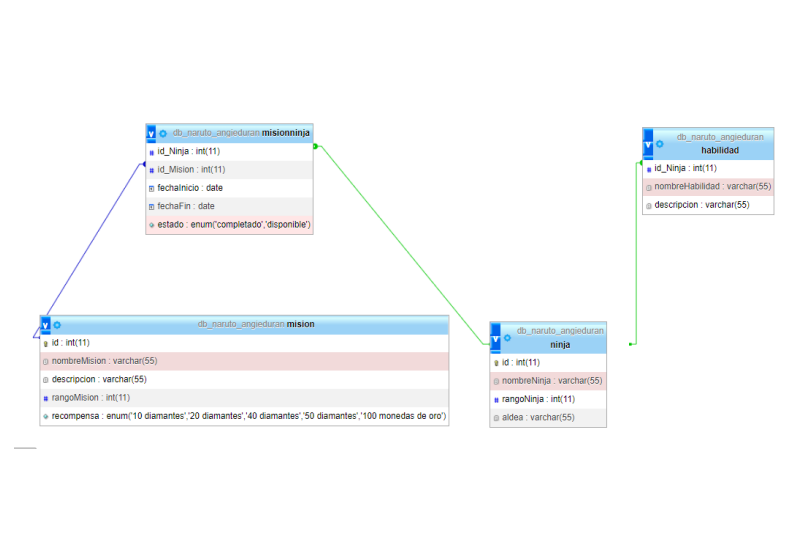
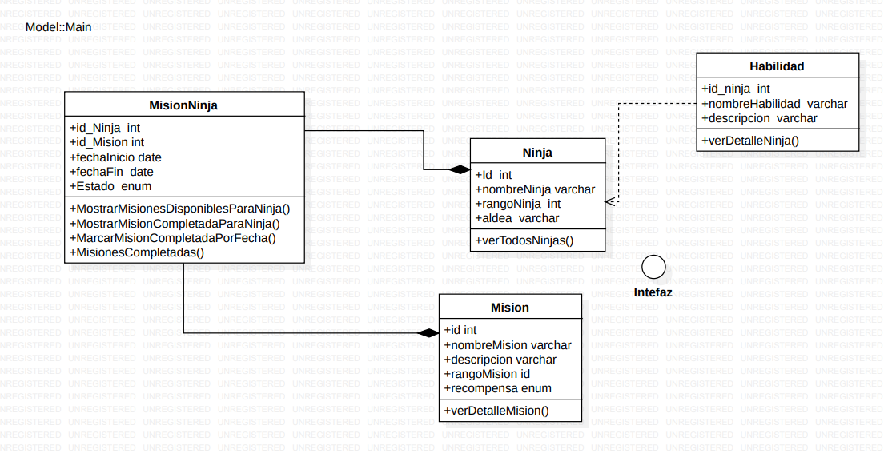

# ALDEA NINJA DE KONOHA 

la aldea ninja de Konoha a decidido modernizar su sistema de gestion de misiones y datos de ninjas para mejorar su eficiencia y la coordinacion entre los equipos . Se le ha encomendado la tarea de desarrollar una aplicacion de java que gestione esta informacion de manera integral. La aplicacion debera incuir:
 
 * Manejo de archivo de texto
 * conexion con una base de datos
 * seguir principios y patrones de diseño 
 * utilizar expresiones lambda y stream API ( para expresiones de forma concisa )
 * interfaz de usuario por consola

 ## Diseño base de datos

 ## Diseño UML 

 